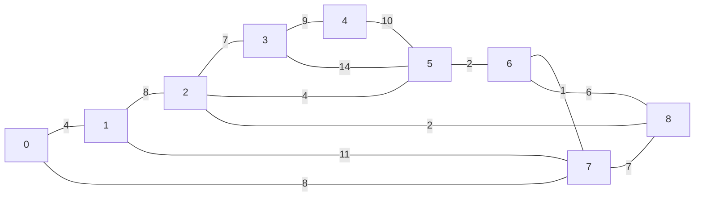
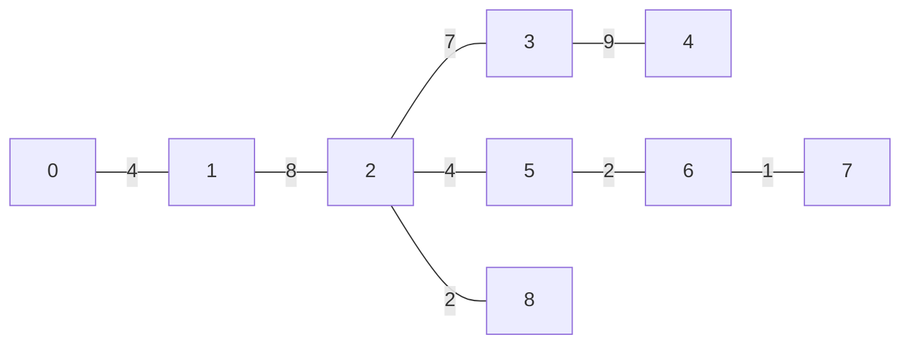
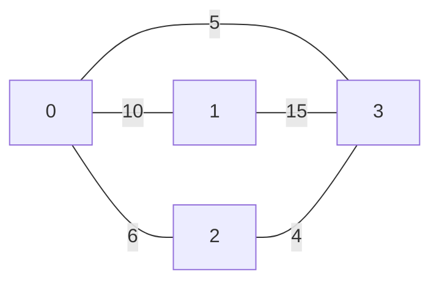
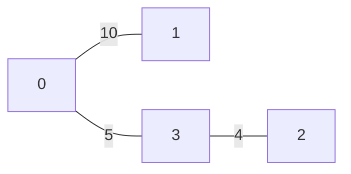
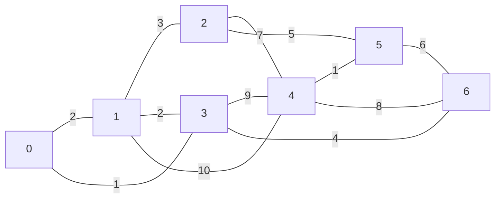
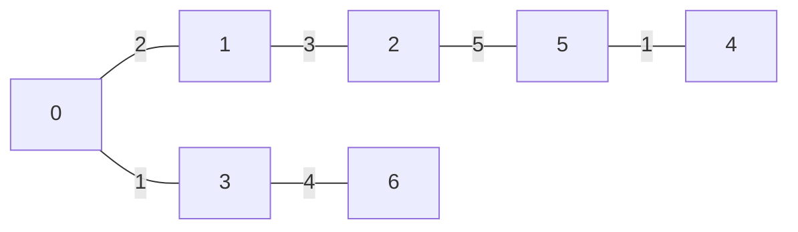
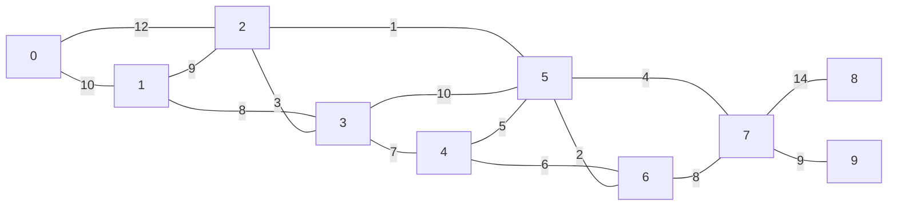
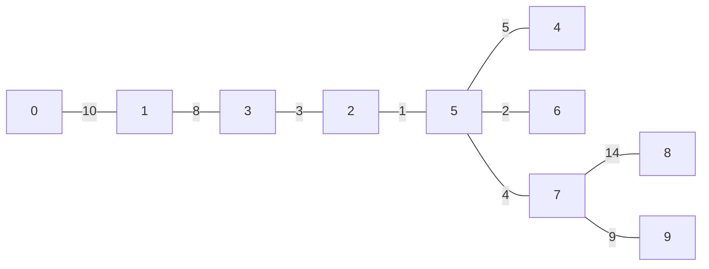
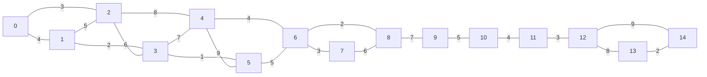
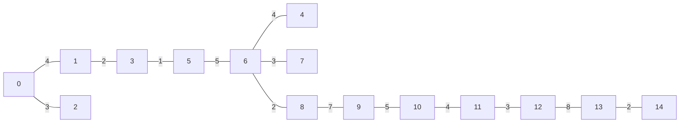

# Minimum Spanning Tree Test Cases

This directory contains test cases for the Minimum Spanning Tree (MST) implementation using Prim's algorithm.

## Input Format

The input files follow this format:

```
[num_vertices]<tab>[num_edges]<tab>[start vertex ID]
[vertex ID]<tab>[vertex ID]<tab>[weight]
[vertex ID]<tab>[vertex ID]<tab>[weight]
...
```

## Output Format

The output files follow this format:

```
[vertex ID]<tab>[predecessor]
[vertex ID]<tab>[predecessor]
...
```

Where `NIL` is used to indicate the root vertex (no predecessor).

## Test Cases

### Test Case 0: Standard Example

- **Source**: Example from the assignment specification
- **Description**: A 9-vertex graph with 14 edges
- **Files**: `input_mst_0.txt` / `output_mst_0.txt`

#### Input



#### Output



### Test Case 1: Small Graph

- **Source**: Custom example
- **Description**: A small 4-vertex graph with 5 edges
- **Files**: `input_mst_1.txt` / `output_mst_1.txt`

#### Input



#### Output



### Test Case 2: Medium Graph

- **Source**: Custom example
- **Description**: A 7-vertex graph with 12 edges
- **Files**: `input_mst_2.txt` / `output_mst_2.txt`

#### Input



#### Output



### Test Case 3: Medium-Large Graph

- **Source**: Custom example
- **Description**: A 10-vertex graph with 15 edges
- **Files**: `input_mst_3.txt` / `output_mst_3.txt`

#### Input



#### Output



### Test Case 4: Large Graph

- **Source**: Custom example
- **Description**: A 15-vertex graph with 21 edges
- **Files**: `input_mst_4.txt` / `output_mst_4.txt`

#### Input



#### Output


